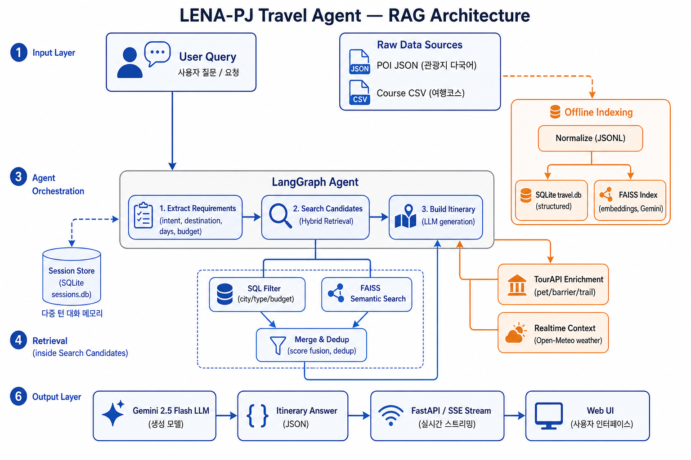
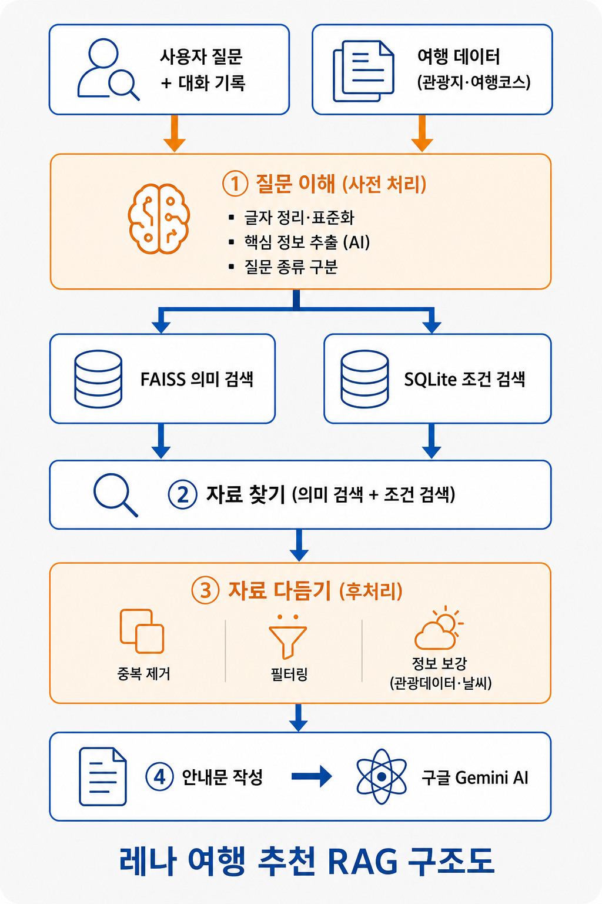

# LENA-PJ_여행 플래너 RAG

LangChain + LangGraph 기반 **여행 플래너 RAG 챗봇**을 직접 구축하며 정리한 과제 회고 문서입니다.

## 1. 목표

- LangChain + LangGraph 기반 **RAG 파이프라인 구축** — 한국 여행 POI·코스 검색 및 일정 추천
- **하이브리드 검색**(SQLite 정형 필터 + FAISS 시맨틱)으로 후보 확보
- **FastAPI**로 REST API + 웹 UI(세션·SSE) 래핑, **CLI** 병행 제공
- 외부 데이터(한국관광공사 TourAPI)·실시간(Open-Meteo 날씨)을 **프롬프트 컨텍스트로 주입**
- **LangSmith**로 체인 실행 Tracing 및 Dataset 기반 평가 (선택)

---

## 2. 버전별 변경 사항 요약


| 버전     | 핵심 변경                                                                                                         | 결과             | 날짜        |
| ------ | ------------------------------------------------------------------------------------------------------------- | -------------- | --------- |
| **v0** | 여행 에이전트 골격 — LangGraph 3노드(추출 → 검색 → 생성), SQLite+FAISS 하이브리드 검색, 세션 UI/사이드바                                   | 여행 일정 생성 기본 동작 | 7/21~7/22 |
| **v1** | 다중 의도 라우팅 — `city_list`(도시 추천), `rewrite_day`(특정 일자만 재작성), 권역 기반 추천 정제                                        | 질문 유형별 프롬프트 분기 | 7/22      |
| **v2** | 일정 UI 개편 — 일자 블록 토글, 접근성 속성, 마크다운 렌더링, JSON/Markdown 내보내기                                                     | 결과 가독성·상호작용 향상 | 7/24      |
| **v3** | 실시간 컨텍스트 — Open-Meteo 날씨 예보 + 휴무 휴리스틱 주입                                                                      | 날씨 반영 일정       | 7/28      |
| **v4** | TourAPI 통합 — 반려동물/무장애/두루누비 등 5개 서비스 보강 텍스트 주입, `/travel/`* 직통 REST 노출, `multi_itinerary`·`qa` 의도, 숙소·활동·축제 보강 | Modular RAG 완성 | 7/29      |
| **v5** | 문서화 — README, 아키텍처 구조도, TourAPI→LLM 통합 흐름 문서 정리                                                               | 구조 설명 정비       | 8/4       |


---


## 3. 핵심 개념 정리


| 1 | 2 |
| :---: | :---: |
|   |  |

### 3-1. RAG 흐름 (Advanced / Modular RAG)

```
사용자 질문 (+ 세션 히스토리 / 이전 일정)
    ↓
[Pre-Retrieval] extract_requirements
    휴리스틱 정규식 + LLM JSON 추출 → 의도(intent)/목적지/일수/예산 결정
    ↓
[Retrieval] search_candidates
    SQL 필터(travel.db) + FAISS 시맨틱 검색 → 병합·중복 제거
    (+ TourAPI 보강 텍스트 수집)
    ↓
[Post-Retrieval + Generation] build_itinerary
    실시간(날씨) · 외부(TourAPI) 컨텍스트 주입 → 의도별 프롬프트 → Gemini 생성
    ↓
answer + itinerary(JSON) + warnings + sources + external 반환
```


### 3-2. 모델 · 백엔드 구성 (현재)


| 역할      | 구성                                          |
| ------- | ------------------------------------------- |
| 임베딩     | Google `models/gemini-embedding-001`        |
| 답변 생성   | Google `gemini-2.5-flash` (temperature 0.2) |
| 정형 검색   | SQLite `travel.db` (places · courses)       |
| 시맨틱 검색  | FAISS (로컬 파일, POI 1500 + 코스 2000)           |
| 실시간     | Open-Meteo 날씨 예보 (API 키 불필요)                |
| 외부 보강   | 한국관광공사 TourAPI 5종 (data.go.kr B551011)      |
| 세션      | SQLite `sessions.db`                        |
| 평가 (선택) | LangSmith Dataset `lena-travel`             |


### 3-3. 파일 구조

```
LENA-PJ/
├── pyproject.toml              # 패키지/의존성/CLI 스크립트 정의 (uv)
├── uv.lock                     # 의존성 잠금 파일
├── .env / .env.example         # API 키 (GOOGLE_API_KEY, DATA_GO_KR_API_KEY, LangSmith)
├── .python-version             # Python 버전 고정 (3.14+)
│
├── docs/                       # 아키텍처/통합 흐름 문서
│   ├── 아키텍처_구조도.md
│   ├── API_통합_흐름.md
│   └── assets/
│       ├── lena_rag_architecture.png
│       └── lena_travel_rag_korean.png
│
├── eval/
│   └── dataset.py              # LangSmith Dataset(lena-travel) 시딩
│
├── scripts/
│   ├── CLI/
│   │   ├── lena-travel         # 여행 에이전트 CLI 진입점
│   │   └── lena-api            # FastAPI 서버 진입점 (uvicorn)
│   ├── build_travel_index.py   # 여행 데이터 전처리 + DB/FAISS 인덱스 빌드
│   └── smoke_travel.py         # 여행 에이전트 스모크 테스트
│
├── data/                       # (gitignore) 원본 + 생성 데이터
│   ├── 221.관광지 소개 다국어 번역 데이터/   # 원본 POI JSON
│   ├── 여행 정보 데이터셋/                  # 원본 여행코스 CSV
│   └── travel/
│       ├── normalized/{pois,courses}.jsonl
│       ├── faiss_index/
│       ├── travel.db
│       └── sessions.db
│
└── src/
    ├── config.py               # 전역 설정 (키/모델/경로/TourAPI/날씨)
    ├── prompts.py              # 여행 프롬프트 템플릿 (의도별 6종)
    ├── main.py                 # 여행 CLI 진입점 (argparse)
    ├── api.py                  # FastAPI 앱 (여행/세션/스트리밍/UI)
    ├── tour_routes.py          # TourAPI 원본 REST 노출 라우터
    ├── front/
    │   └── index.html          # 여행 챗 웹 UI (세션 사이드바 + SSE)
    │
    └── travel/                 # 여행 에이전트 패키지
        ├── travel_agent.py         # 파사드 (ask_travel / 세션 / 스트리밍)
        ├── travel_graph.py         # LangGraph 3노드 + 스트리밍 변형
        ├── travel_tools.py         # 하이브리드 검색 (SQL + FAISS 병합)
        ├── travel_repository.py    # SQLite places/courses 검색
        ├── travel_vectorstore.py   # 여행 FAISS 빌드(배치/재시도/체크포인트)
        ├── travel_ingestion.py     # 원본 → JSONL 정규화 + Document 변환
        ├── session_store.py        # 세션/메시지 영속화 (sessions.db)
        ├── travel_realtime.py      # Open-Meteo 날씨 + 휴무 휴리스틱
        ├── tour_enrich.py          # TourAPI 의도 감지 → 보강 텍스트
        └── tour_api/               # TourAPI 저수준 HTTP 클라이언트
            ├── _client.py          # 공통 요청/정규화/에러 처리
            ├── kor_service.py      # 국문 관광정보 KorService2
            ├── kor_pet_tour.py     # 반려동물 동반여행 KorPetTourService2
            ├── kor_with_service.py # 무장애 여행 KorWithService2
            ├── durunubi.py         # 두루누비 걷기여행길
            └── tar_rlte_tar.py     # 관광지별 연관 관광지
```


| 파일                                 | 역할                                                                           |
| ---------------------------------- | ---------------------------------------------------------------------------- |
| `src/config.py`                    | 환경변수, 모델명, 경로, TourAPI/날씨 설정, 임베딩 배치 설정                                      |
| `src/prompts.py`                   | 여행 프롬프트 템플릿 (의도별 6종)                                                         |
| `src/main.py`                      | 여행 CLI 진입점 (`question`, `--destination`, `--days`, `--budget`, `--language`) |
| `src/api.py`                       | FastAPI — 여행/세션/스트리밍/웹 UI                                                    |
| `src/tour_routes.py`               | TourAPI 원본 데이터를 `/travel/*` 로 직통 노출                                          |
| `src/front/index.html`             | 여행 챗 웹 UI (세션 사이드바 + SSE)                                                    |
| `src/travel/travel_ingestion.py`   | 원본 POI JSON·코스 CSV → JSONL 정규화 + Document 변환                                 |
| `src/travel/travel_repository.py`  | SQLite `places`/`courses` 검색, 도시 별칭                                          |
| `src/travel/travel_vectorstore.py` | 여행 FAISS 빌드/로드 (배치 임베딩·429 재시도·체크포인트)                                        |
| `src/travel/travel_tools.py`       | 하이브리드 검색 (SQL + FAISS 병합)                                                    |
| `src/travel/travel_graph.py`       | LangGraph 3노드 정의 + 토큰 스트리밍 변형                                                |
| `src/travel/travel_agent.py`       | 파사드 — `ask_travel` / 세션 / 스트리밍 래퍼                                            |
| `src/travel/session_store.py`      | 세션·메시지 영속화 (`sessions.db`)                                                   |
| `src/travel/travel_realtime.py`    | Open-Meteo 날씨 + 휴무 휴리스틱                                                      |
| `src/travel/tour_enrich.py`        | 질문 의도 감지 → TourAPI 호출 → 보강 텍스트                                               |
| `src/travel/tour_api/*`            | 관광공사 5개 서비스별 저수준 HTTP 클라이언트                                                  |
| `eval/dataset.py`                  | LangSmith Dataset(`lena-travel`) 생성 및 예제 시드                                  |
| `scripts/build_travel_index.py`    | 여행 인덱스 빌드 (정규화 + SQLite + FAISS)                                             |
| `scripts/smoke_travel.py`          | 여행 에이전트 스모크 테스트                                                              |
| `scripts/CLI/lena-travel`          | 여행 CLI 래퍼 → `src/main.py`                                                    |
| `scripts/CLI/lena-api`             | Uvicorn 서버 래퍼 → `src.api:app`                                                |


### 3-4. 실행 흐름 (CLI 기준)

```
사용자가 lena-travel "제주 2박3일 여행 추천해줘" 실행
    ↓
scripts/CLI/lena-travel → src/main.py (argparse: question, --destination, --days, --budget, --language)
    ↓
src/travel/travel_agent.py — ask_travel(question, ...)
    ↓
travel_agent — get_travel_agent()  [@lru_cache, 최초 1회만 그래프/검색/세션 준비]
    ↓
travel_graph — ① extract_requirements
    ├── 휴리스틱 정규식 + LLM JSON 추출
    └── 의도/목적지/일수/예산 확정
    ↓
travel_graph — ② search_candidates
    ├── TravelSearchService: SQL 필터(travel.db) + FAISS 시맨틱 → 병합·중복 제거
    └── build_tour_context(): 의도 감지 시 TourAPI 보강 텍스트 수집
    ↓
travel_graph — ③ build_itinerary
    ├── build_realtime_context(): Open-Meteo 날씨/휴무 → realtime_text
    ├── realtime_text + external_text(TourAPI) 를 프롬프트에 주입
    └── 의도별 프롬프트 + gemini-2.5-flash → JSON 답변 생성/파싱
    ↓
ask_travel() — result 반환 → main.py 가 질문/답변/경고 터미널 출력
```


### 3-5. 실행 흐름 (FastAPI 기준)

```
사용자가 POST /travel/query {"question": "...", "destination": "제주", "days": 3} 전송
    ↓
src/api.py — travel_query()
    ↓
src/travel/travel_agent.py — ask_travel(...)  [CLI와 동일한 그래프 파이프라인]
    ↓
TravelQueryResponse(question, answer, itinerary, warnings, sources, external ...) JSON 응답

# 세션/스트리밍 경로
POST /travel/sessions/{id}/query          → ask_travel_in_session()  (히스토리 주입 + 저장)
POST /travel/sessions/{id}/query/stream   → stream_travel_in_session()  (SSE 토큰 스트리밍)
```

---


## 4. 겪었던 문제와 해결


| 문제                             | 원인                                    | 해결                                                                               | 파일                                                           |
| ------------------------------ | ------------------------------------- | -------------------------------------------------------------------------------- | ------------------------------------------------------------ |
| `.env` 가 push 됨                | 커밋 대상에 `.env` 포함                      | `.gitignore` 확인 후 추적 제외, `.env.example`만 유지                                      | `.gitignore`, `.env.example`                                 |
| 임베딩 도중 청킹이 멈춤                  | Gemini free tier embed 100 req/min 초과 | 배치(80건)마다 65초 대기 + 429 재시도 + 체크포인트 재개                                            | `src/config.py`, `src/travel/travel_vectorstore.py`          |
| API 키 없을 때 불명확한 에러             | `GOOGLE_API_KEY` None 검증 없음           | 시작 시 `ValueError` 발생                                                             | `src/config.py`                                              |
| TourAPI Encoding 키 사용 시 이중 인코딩 | `urlencode`가 다시 인코딩                   | data.go.kr "일반 인증키(Decoding)" 값 사용하도록 통일                                         | `src/config.py`, `src/travel/tour_api/_client.py`            |
| 외부 API 실패 시 챗봇 전체 중단 우려        | TourAPI/날씨 호출이 답변 경로에 결합              | 실패해도 빈 컨텍스트 반환 → 기본 동작 유지(장애 격리)                                                 | `src/travel/tour_enrich.py`, `src/travel/travel_realtime.py` |
| import 시마다 그래프/인덱스 초기화         | 모듈 레벨 초기화                             | `@lru_cache` + `get_travel_agent()`로 lazy init                                   | `src/travel/travel_agent.py`                                 |
| 질문 유형 무시하고 항상 일정만 생성           | 단일 프롬프트                               | 의도(intent) 라우팅으로 `city_list`/`qa`/`rewrite_day`/`multi_itinerary`/`itinerary` 분기 | `src/travel/travel_graph.py`, `src/prompts.py`               |


---


## 5. 실행 방법


### 가상환경 설치

```bash
uv sync
```


### 여행 인덱스 빌드 (최초 1회)

```bash
# 전체 빌드 (정규화 + SQLite + FAISS)
uv run python scripts/build_travel_index.py

# SQLite만 빠르게 (FAISS 생략)
uv run python scripts/build_travel_index.py --skip-faiss

# FAISS만 다시 생성
uv run python scripts/build_travel_index.py --faiss-only --force-faiss
```


### 5. 실행

```bash
uv run python scripts/CLI/lena-travel   # 여행 에이전트 CLI
uv run python scripts/CLI/lena-api      # 웹/API 서버 → http://localhost:8000
```

---


## API 엔드포인트


| 메서드                                                                   | 경로                                   | 설명            |
| --------------------------------------------------------------------- | ------------------------------------ | ------------- |
| `GET`                                                                 | `/`                                  | 여행 챗 웹 UI     |
| `POST`                                                                | `/travel/query`                      | 여행 에이전트 (무상태) |
| `POST`                                                                | `/travel/sessions/{id}/query`        | 세션 기반 여행 질의   |
| `POST`                                                                | `/travel/sessions/{id}/query/stream` | SSE 토큰 스트리밍   |
| `GET/POST/PATCH/DELETE`                                               | `/travel/sessions/*`                 | 세션 CRUD       |
| `GET`                                                                 | `/travel/places/{poi_id}`            | POI 상세 조회     |
| `/travel/kor/*` · `/pet/*` · `/with/*` · `/durunubi/*` · `/related/*` | TourAPI 원본                           |               |


### 예시

여행 Q&A (`question`만 필수):

```bash
curl -X POST http://localhost:8000/travel/query \
  -H "Content-Type: application/json" \
  -d '{"question": "제주 반려동물이랑 갈만한 2박3일 여행 추천해줘", "destination": "제주", "days": 3}'
```


### LangSmith Dataset 시드 (선택)

```bash
uv run python eval/dataset.py
```

---


## 6. 회고


### 6-1. 과정 서술

여행 플래너로 확장하면서 "검색 → 생성"만 하는 단순 RAG가 아니라, 의도별 라우팅 · 하이브리드 검색 · 실시간 날씨 · 관광공사 API 보강 · 세션까지 얹은 Modular RAG 형태가 되었다. 외부 API가 실패해도 빈 컨텍스트로 챗봇이 계속 동작하도록 다른 장애가 발생했을 때를 대비해 격리한 부분이 마음에 든다.

조금 늦게 마음먹고 시작하는 바람에 절대적인 시간이 부족했지만 어떤식으로 접근해야 되는지 앞으로 프로젝트를 어떻게 대해야 할지에 대한 개인적인 태도를 만들고자 하는 시간이였다. 또한, 실제로 LLM에게 거의 모든 것을 의탁하여 코드를 짜도록 하였더니 기술이 늘어나고 복잡해질 수록 처음엔 금방 익힐 수 있는 양이라고 생각했다가 그러지 못한다는 것을 깨닫는 계기가 된 시간이다. 


[아래 과정 반복하여 학습]

- 코드 뜯어보기 - AI 없이 부분부분 손코딩(노트/수도코드) - 공식문서와 웹 서핑으로만 정보 확인 후 짜기 - 전체 틀 이해하기
- 위 과정을 진행하며 리팩토링 해보기
- 프롬프트 다듬기
- 추가적인 기술 추가

**〈〈마음가짐〉〉**

- LLM을 과외쌤처럼 사용할 것 (알려주세요 X, 길잡이 용도)
- 인공지능에 자아의탁을 하지 않는다.
- 항상 어떤 의미로 이 코드를 왜 추가했는지 정리해달라고 한다.
- ask 모드로 사용, agent 모드는 지양


### 6-2. 앞으로 할 일

- [ ] LangSmith Dataset(`lena-travel`) 기반 평가
- [ ] 하이브리드 검색 가중치/`top_k` 튜닝, 빈 검색 fallback 개선
- [ ] TourAPI 의도 감지 정확도 향상 (pet/barrier/trail 외 확장)
- [ ] aws / Docker 사용해서 배포


---
### 궁극적으로 추가 하고 싶은 기술/기능

## 추가하고 싶은 궁극적 기술들

<여행>
- 실시간 기능
	- 날씨
	- 운영시간
	- 요금
	- 동선 등...
- 예산 정리 기능

<여행 및 길 찾기>
- 나만의 로드맵
	- A 목적지와 B 목적지로 가는 방법 
		- 도보, 자전거 - 특화 시키기  
		- 택시, 버스 - 기본
		- 다른 맵과의 차이점 = 빠른길 + 구경하기 좋은 길(걷기 좋은 길)
	- 커스텀 로드
		- 생각해둔 경로로 갔을 때 시간 계산
		- 다른 사람들이 간 경로 참고 가능(경로 당시 시간대 포함)

- 노약자 및 어린이, 휠체어가 다니기 편한 길
