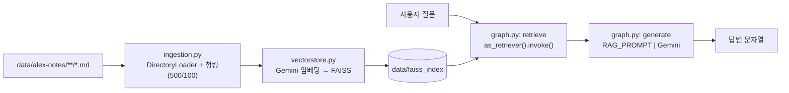
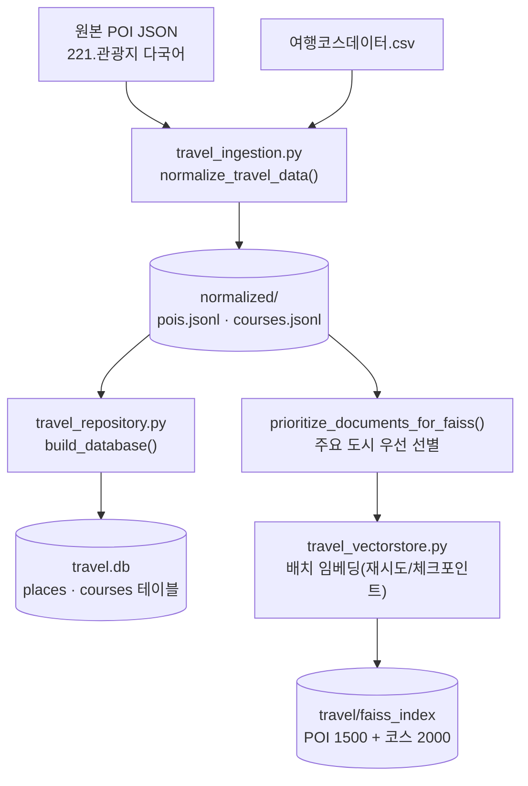
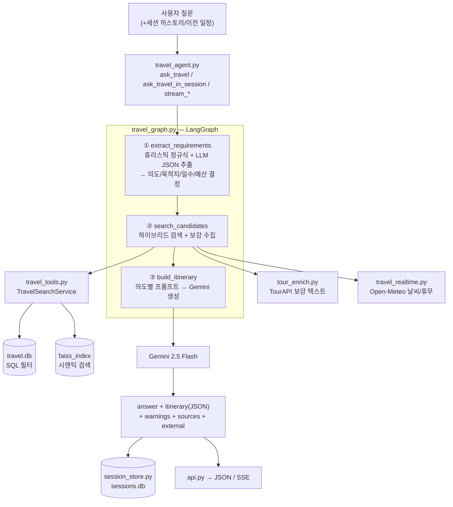
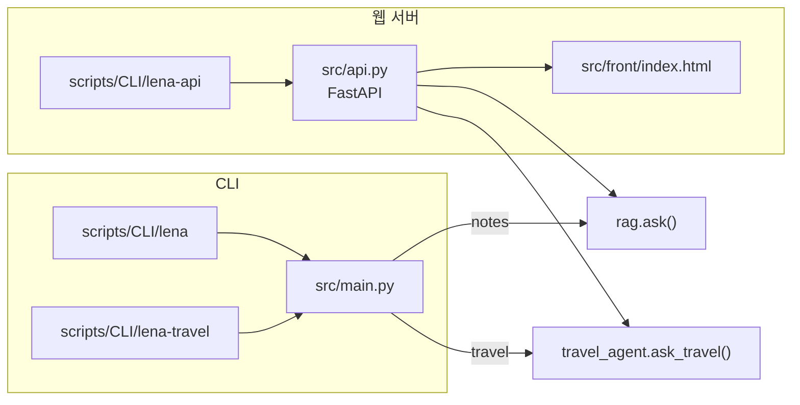

# LENA-PJ 아키텍처 구조도 & 전체 구조 설명서

> RAG(Retrieval-Augmented Generation) 기반의 LENA-PJ 프로젝트 전체 아키텍처와,
> 현재 구조로 개편된 **두 개의 LangGraph 에이전트**(노트 RAG / 여행 플래너)의
> 파이프라인·디렉토리·파일 역할을 상세히 정리한 문서입니다.

---

## 0. 한눈에 보는 아키텍처 구조도


LENA-PJ는 학술적으로 분류하면 **Advanced / Modular RAG** 형태입니다.
단순히 "검색 → 생성"만 하는 Naive RAG가 아니라, 아래와 같은 모듈이 추가되어 있습니다.

| RAG 발전 단계 | LENA-PJ에서의 대응 |
|---------------|--------------------|
| **Pre-Retrieval** (전처리) | 정규화 → SQLite/FAISS 이중 인덱싱, 의도(intent) 추출·질의 재작성 |
| **Retrieval** (검색) | SQL 필터 + FAISS 시맨틱 검색의 **하이브리드 검색** |
| **Post-Retrieval** (후처리) | Merge & Dedup(중복 제거·의미 우선 병합), 지역 포커스/제외 필터 |
| **Generation** (생성) | 의도별 프롬프트 라우팅 + 실시간/외부 컨텍스트 주입 후 Gemini 생성 |
| **Modular 모듈** | TourAPI 보강, Open-Meteo 실시간, 세션 메모리, 스트리밍 |

---

## 1. 프로젝트 개요

LENA-PJ는 **두 개의 독립적인 RAG 에이전트**를 제공합니다.

| 에이전트 | 역할 | 검색 백엔드 | 특징 |
|----------|------|-------------|------|
| **Notes RAG** | 개인 마크다운 노트 기반 Q&A | FAISS only | 단순 2노드 그래프 (retrieve → generate) |
| **Travel Planner** | 한국 여행 POI·코스 검색 및 일정 추천 | SQLite + FAISS 하이브리드 | 3노드 그래프, 다중 의도, 세션, 실시간, 외부 API |

**기술 스택**: `Python 3.14+` · `FastAPI` · `LangGraph` · `LangChain` · `Google Gemini(LLM+임베딩)` · `FAISS` · `SQLite` · `Open-Meteo` · `한국관광공사 TourAPI(data.go.kr)`

**의존성 관리**: `pyproject.toml` + `uv` (별도 `requirements.txt` 없음)

---

## 2. 전체 디렉토리 구조

```
LENA-PJ/
├── pyproject.toml              # 패키지/의존성/CLI 스크립트 정의 (uv 기반)
├── uv.lock                     # 의존성 잠금 파일
├── .env / .env.example         # API 키 (GOOGLE_API_KEY, DATA_GO_KR_API_KEY, LangSmith)
├── .python-version             # Python 버전 고정
│
├── docs/                       # 아키텍처/통합 흐름 문서
│   ├── API_통합_흐름.md          # 관광공사 API → LLM 통합 흐름 상세
│   └── 아키텍처_구조도.md         # (본 문서)
│
├── eval/
│   └── dataset.py              # LangSmith 평가용 데이터셋(lena-travel) 시딩
│
├── scripts/
│   ├── CLI/
│   │   ├── lena                # 노트 RAG CLI 진입점
│   │   ├── lena-travel         # 여행 에이전트 CLI 진입점
│   │   └── lena-api            # FastAPI 서버 진입점 (uvicorn)
│   ├── build_travel_index.py   # 여행 데이터 전처리 + DB/FAISS 인덱스 빌드
│   └── smoke_travel.py         # 여행 에이전트 스모크 테스트
│
├── data/                       # (대부분 gitignore) 원본 + 생성 데이터
│   ├── 221.관광지 소개 다국어 번역 데이터/   # 원본 POI JSON
│   ├── 여행 정보 데이터셋/                  # 원본 여행코스 CSV
│   ├── faiss_index/                        # 노트 RAG FAISS 인덱스
│   └── travel/
│       ├── normalized/{pois,courses}.jsonl # 정규화 결과
│       ├── faiss_index/                    # 여행 FAISS 인덱스(+checkpoint)
│       ├── travel.db                       # 여행 구조화 DB (SQLite)
│       └── sessions.db                     # 대화 세션 저장소 (SQLite)
│
└── src/                        # 핵심 애플리케이션 코드
    ├── config.py               # 전역 설정 (키/모델/경로/청크/TourAPI/날씨)
    ├── prompts.py              # 모든 프롬프트 템플릿 (노트 1 + 여행 6종)
    ├── main.py                 # CLI 진입점 (--agent notes|travel 분기)
    ├── api.py                  # FastAPI 앱 (노트/여행/세션/스트리밍/UI)
    │
    ├── ingestion.py            # [노트] 문서 로딩 + 청킹
    ├── vectorstore.py          # [노트] FAISS 벡터스토어 빌드/로드
    ├── graph.py                # [노트] LangGraph (retrieve → generate)
    ├── rag.py                  # [노트] 에이전트 파사드 (ask())
    │
    ├── tour_routes.py          # [여행] TourAPI 원본 데이터 REST 노출 라우터
    ├── front/
    │   └── index.html          # 여행 챗 웹 UI (세션 사이드바 + SSE)
    │
    └── travel/                 # [여행] 에이전트 패키지
        ├── travel_ingestion.py     # 원본 → JSONL 정규화 + Document 변환
        ├── travel_repository.py    # SQLite 구조화 저장/검색 (places/courses)
        ├── travel_vectorstore.py   # 여행 FAISS 빌드(배치/재시도/체크포인트)
        ├── travel_tools.py         # 하이브리드 검색 (SQL + FAISS 병합)
        ├── travel_graph.py         # 여행 LangGraph (3노드 + 스트리밍 변형)
        ├── travel_agent.py         # 여행 파사드 (세션/스트리밍 래퍼)
        ├── session_store.py        # 세션/메시지 영속화 (sessions.db)
        ├── travel_realtime.py      # 실시간 컨텍스트 (Open-Meteo 날씨/휴무)
        ├── tour_enrich.py          # TourAPI 의도 감지 → 보강 텍스트 생성
        └── tour_api/               # TourAPI 저수준 HTTP 클라이언트
            ├── _client.py          # 공통 요청/정규화/에러 처리
            ├── kor_service.py      # 국문 관광정보 KorService2
            ├── kor_pet_tour.py     # 반려동물 동반여행 KorPetTourService2
            ├── kor_with_service.py # 무장애 여행 KorWithService2
            ├── durunubi.py         # 두루누비 걷기여행길
            └── tar_rlte_tar.py     # 관광지별 연관 관광지
```

---

## 3. 에이전트 A — Notes RAG (단순 2노드 파이프라인)

개인 마크다운 노트를 대상으로 하는 **가장 표준적인 Naive RAG** 구현입니다.

### 3.1 파이프라인



### 3.2 파일별 역할

| 파일 | 역할 | 핵심 내용 |
|------|------|-----------|
| `src/ingestion.py` | **문서 로딩 + 청킹** | `DirectoryLoader`로 `**/*.md` 로드, `RecursiveCharacterTextSplitter`(size=500, overlap=100)로 분할 |
| `src/vectorstore.py` | **벡터스토어** | `GoogleGenerativeAIEmbeddings`로 임베딩, `data/faiss_index`에 저장/로드(`_index_exists`) |
| `src/graph.py` | **LangGraph 오케스트레이션** | `RAGState{query, documents, answer}` 상태. `retrieve`(FAISS 검색) → `generate`(프롬프트+LLM) → END |
| `src/rag.py` | **파사드** | `@lru_cache get_agent()`로 그래프 캐싱, `ask(query)` 단일 진입 함수 |
| `src/prompts.py` | **프롬프트** | `RAG_PROMPT` (context + question → 답변) |

> **특징**: 툴 호출/멀티턴 메모리/리랭킹 없음. 순수 "검색 → 생성"의 참조 구현입니다.

---

## 4. 에이전트 B — Travel Planner (핵심, 개편된 구조)

현재 프로젝트의 중심. **3노드 LangGraph + 하이브리드 검색 + 다중 의도 라우팅 + 실시간/외부 보강 + 세션 메모리 + SSE 스트리밍**을 갖춘 Modular RAG입니다.

### 4.1 오프라인 인덱싱 파이프라인 (검색 준비 단계)

`scripts/build_travel_index.py`가 원본 데이터를 검색 가능한 형태로 만듭니다.



| 단계 | 파일 | 역할 |
|------|------|------|
| 정규화 | `travel/travel_ingestion.py` | 원본 POI JSON·코스 CSV → 구조화 레코드 → `pois.jsonl`/`courses.jsonl`, LangChain `Document` 변환 |
| 구조화 저장 | `travel/travel_repository.py` | `places`/`courses` 테이블 생성, 도시/타입/예산 필터 SQL 검색, `CITY_ALIASES` 별칭 |
| 벡터 인덱싱 | `travel/travel_vectorstore.py` | Gemini 임베딩(배치 80/65초 대기, 429 재시도, 체크포인트 재개), `prioritize_documents_for_faiss()` |

### 4.2 런타임 에이전트 파이프라인 (LangGraph 3노드)



### 4.3 3개 노드 상세

#### 노드 ① `extract_requirements` — 요구사항/의도 추출 (Pre-Retrieval)

1. **휴리스틱 정규식**으로 목적지·일수·예산·재작성 대상 일자(`rewrite_day`)를 빠르게 추출
2. **LLM JSON 추출**(`TRAVEL_EXTRACT_PROMPT`)로 자연어에서 구조화 요구사항 파싱
3. **의도 해석**(`_resolve_intent`) — 아래 우선순위로 확정:

| 의도(intent) | 트리거 | 사용 프롬프트 |
|--------------|--------|---------------|
| `city_list` | "어디가 좋아?" 등 도시 나열형 | `TRAVEL_CITY_LIST_PROMPT` |
| `multi_itinerary` | 여러 개 일정 요청 | `TRAVEL_MULTI_ITINERARY_PROMPT` |
| `qa` | 단순 질의응답 | `TRAVEL_QA_PROMPT` |
| `rewrite_day` | "2일차만 바꿔줘" | `TRAVEL_REWRITE_DAY_PROMPT` |
| `itinerary` (기본) | 일반 일정 생성 | `TRAVEL_ITINERARY_PROMPT` |

#### 노드 ② `search_candidates` — 하이브리드 검색 + 컨텍스트 수집 (Retrieval + 보강)

- **`TravelSearchService`**(`travel_tools.py`)가 두 백엔드를 병합:
  - **SQL 필터**: 도시/타입/예산 조건으로 `travel.db` 검색
  - **FAISS 시맨틱**: `similarity_search`로 의미 유사 후보 검색
  - **병합(`_merge_by_key`)**: `poi_id`/`package_id` 기준 중복 제거, **시맨틱 결과를 앞에 배치**(암묵적 우선순위)
- 숙소(stays) 별도 검색, 지역 포커스/제외 도시 필터링
- **`build_tour_context()`**(`tour_enrich.py`): 질문에서 `pet`/`barrier`/`trail` 의도 감지 → TourAPI 호출 → 보강 텍스트(`external_text`) 생성 (실패해도 조용히 빈 값)

#### 노드 ③ `build_itinerary` — 실시간 주입 + 생성 (Post-Retrieval + Generation)

- **`build_realtime_context()`**(`travel_realtime.py`): Open-Meteo 날씨 예보 + 휴무일 휴리스틱 → `realtime_text`
- `realtime_text`에 `external_text`(TourAPI)를 합쳐 프롬프트 `{realtime}` 자리에 주입
- **의도별 프롬프트 분기** 후 Gemini 호출 → JSON 파싱 → `itinerary`/`answer`/`warnings` 추출
- 후처리: 숙소 정제, 일자 병합, 폴백 처리

### 4.4 여행 에이전트 파일별 역할

| 파일 | 계층 | 역할 |
|------|------|------|
| `travel/travel_agent.py` | 파사드 | `ask_travel`(1회 실행), `ask_travel_in_session`(세션 실행+저장), `stream_travel_in_session`(SSE). `@lru_cache`로 그래프/검색/세션 캐싱 |
| `travel/travel_graph.py` | 오케스트레이션 | `TravelState`(약 25개 필드), 3노드 정의·연결, `stream_build_itinerary_tokens()`(토큰 스트리밍 변형) |
| `travel/travel_tools.py` | 검색 | `TravelSearchService.search_places/search_courses` — SQL+FAISS 하이브리드 병합 |
| `travel/travel_repository.py` | 저장소 | SQLite `places`/`courses` CRUD·검색, 도시 별칭 |
| `travel/travel_vectorstore.py` | 벡터 | 여행 FAISS 빌드/로드, 배치 임베딩, 문서 우선순위화 |
| `travel/travel_ingestion.py` | 인제스션 | 원본 → JSONL 정규화, Document 변환 |
| `travel/session_store.py` | 세션 | `sessions.db`에 세션/메시지 영속화, 최근 8턴 히스토리 텍스트 제공 |
| `travel/travel_realtime.py` | 실시간 | Open-Meteo 날씨 + 휴무 휴리스틱 |
| `travel/tour_enrich.py` | 외부 보강 | 의도 감지 → TourAPI 데이터 → LLM용 텍스트 |
| `src/tour_routes.py` | REST | TourAPI 원본을 `/travel/kor/*` 등으로 직통 노출 |

### 4.5 TourAPI 클라이언트 (`travel/tour_api/`)

| 파일 | 서비스 | 대표 기능 |
|------|--------|-----------|
| `_client.py` | 공통 | `urllib` HTTP 요청, `normalize_items`/`paged`, `TourAPIError` |
| `kor_service.py` | KorService2 | 지역/키워드/축제/숙박/상세 검색 |
| `kor_pet_tour.py` | KorPetTourService2 | 반려동물 동반여행 |
| `kor_with_service.py` | KorWithService2 | 무장애 여행 |
| `durunubi.py` | Durunubi | 걷기여행길(코리아둘레길) |
| `tar_rlte_tar.py` | TarRlteTarService1 | 관광지별 연관 관광지 |

> TourAPI는 **LLM이 직접 tool-calling으로 부르는 방식이 아니라**, 코드가 미리 호출해 텍스트로 정리한 뒤 **프롬프트 컨텍스트로 주입하는 RAG 방식**입니다. (상세: `docs/API_통합_흐름.md`)

---

## 5. 서비스 계층 (진입점 & API)



### 주요 API 엔드포인트 (`src/api.py`)

| 메서드 | 경로 | 설명 |
|--------|------|------|
| `GET` | `/` | 여행 챗 웹 UI |
| `POST` | `/query` | 노트 RAG Q&A |
| `POST` | `/travel/query` | 여행 에이전트 (무상태) |
| `POST` | `/travel/sessions/{id}/query` | 세션 기반 여행 질의 |
| `POST` | `/travel/sessions/{id}/query/stream` | SSE 토큰 스트리밍 |
| `GET/POST/PATCH/DELETE` | `/travel/sessions/*` | 세션 CRUD |
| `GET` | `/travel/places/{poi_id}` | POI 상세 조회 |
| `/travel/kor/*`·`/pet/*`·`/with/*`·`/durunubi/*`·`/related/*` | TourAPI 원본 직통 노출 |

### 실행 방법

```bash
# 1) 여행 인덱스 빌드 (최초 1회) — travel.db + FAISS 생성
uv run python scripts/build_travel_index.py

# 2) 실행
uv run python scripts/CLI/lena          # 노트 RAG CLI
uv run python scripts/CLI/lena-travel   # 여행 CLI
uv run python scripts/CLI/lena-api      # 웹/API 서버 → http://localhost:8000
```

---

## 6. 환경 변수

| 변수 | 필수 | 용도 |
|------|------|------|
| `GOOGLE_API_KEY` | 예 | Gemini LLM + 임베딩 |
| `DATA_GO_KR_API_KEY` | 선택 | TourAPI 보강/노출 (없으면 해당 기능만 비활성) |
| `LANGSMITH_API_KEY` / `LANGCHAIN_TRACING_V2` / `LANGCHAIN_PROJECT` | 선택 | LangSmith 트레이싱 |

---

## 7. 핵심 설계 특징 요약

1. **두 개의 병렬 RAG 시스템** — Gemini 모델은 공유, 검색 백엔드는 상이 (노트: FAISS only / 여행: SQLite+FAISS 하이브리드).
2. **에이전트 = LangGraph 상태 머신** — ReAct/tool-calling 방식이 아니라, 외부 기능을 그래프 노드 내부에서 일반 파이썬 서비스 호출로 수행.
3. **여행 에이전트는 Modular RAG** — 다중 의도 라우팅, 세션 메모리, 실시간 날씨, TourAPI 보강, JSON 출력 정제/폴백까지 포함.
4. **장애 격리 설계** — TourAPI/날씨 등 외부 호출이 실패해도 빈 컨텍스트로 챗봇 기본 동작 유지.
5. **선행 조건** — 여행 에이전트는 `build_travel_index.py`로 인덱스를 먼저 만들어야 하며, 노트 에이전트는 `data/alex-notes/`에 마크다운이 필요.
